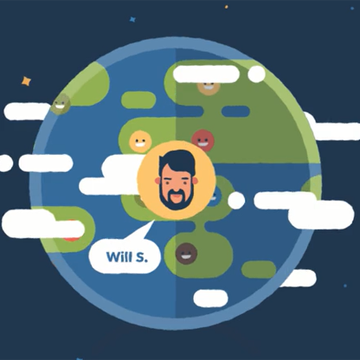

Quick code reference

Front code collections for quickly input

### Callback when animation ends
    var ANI_EVENT_NAME = 'webkitAnimationEnd mozAnimationEnd MSAnimationEnd oanimationend animationend';
    $(ele).on(ANI_EVENT_NAME,
        function(){
            $(this).off(ANI_EVENT_NAME);
        }
	);

