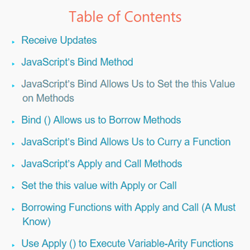

We will discuss every scenario in which we use these three methods in JavaScript. While Apply and Call come with ECMAScript 3 (available on IE 6, 7, 8, and modern browsers), ECMAScript 5 (available on only modern browsers) added the Bind method. These 3 Function methods are workhorses and sometimes you absolutely need one of them. Let’s begin with the Bind method. 

## Bind()

### JavaScript's Bind Allows Us to Set the this Value on Methods

When the button below is clicked, the text field is populated with a random name.
    
    var user = {
        data :[
            {name:"T. Woods", age:37},
            {name:"P. Mickelson", age:43}
        ],
        clickHandler:function (event) {
            var randomNum = ((Math.random () * 2 | 0) + 1) - 1; // random number between 0 and 1
            // This line is adding a random person from the data array to the text field
            $("input").val (this.data[randomNum].name + " " + this.data[randomNum].age);
        }
    }
    ​// Assign an eventHandler to the button's click event
    $ ("button").click (user.clickHandler);
    

When you click the button, you get an error because this in the clickHandler () method is bound to the button HTML element, since that is the object that the clickHandler method is executed on.

This particular problem is quite common in JavaScript, and JavaScript frameworks like Backbone.js and libraries like jQuery automatically do the bindings for us, so that this is always bound to the object we expect it to be bound to.

To fix the problem in the preceding example, we can use the bind method thus:
Instead of this line:

     $ ("button").click (user.clickHandler.bind (user));

### Bind() Allows us to **Borrow** Methods
In JavaScript, we can pass functions around, return them, borrow them, and the like. And the bind () method makes it super easy to borrow methods.

Here is an example using bind () to borrow a method:

        var cars = {
                data:[
                    {name:"Honda Accord", age:14},
                    {name:"Tesla Model S", age:2}
                ]
            }
        // We can borrow the showData () method from the user object we defined in the last example.
        // Here we bind the user.showData method to the cars object we just created.
        cars.showData = user.showData.bind (cars);
        cars.showData(); // Honda Accord 14
One problem with this example is that we are adding a new method (showData) on the cars object and we might not want to do that just to borrow a method because the cars object might already have a property or method name showData. We don’t want to overwrite it accidentally. As we will see in our discussion of Apply and Call below, it is best to borrow a method using either the Apply or Call method. 
            

### JavaScript’s Bind Allows Us to Curry a Function


Function Currying, also known as partial function application, is the use of a function (that accept one or more arguments) that returns a new function with some of the arguments already set. The function that is returned has access to the stored arguments and variables of the outer function. This sounds way more complex than it actually is, so let’s code.

    //So we are passing null because we are not using the "this" keyword in our greet function.​
    var greetAnAdultMale = greet.bind (null, "male", 45);
    greetAnAdultMale ("John Hartlove"); // "Hello, Mr. John Hartlove."​
    var greetAYoungster = greet.bind (null, "", 16);
    greetAYoungster ("Alex"); // "Hey, Alex."​
    greetAYoungster ("Emma Waterloo"); // "Hey, Emma Waterloo."​
    

## JavaScript’s Apply and Call Methods

The Apply and Call methods are two of the most often used Function methods in JavaScript, and for good reason: they allow us to borrow functions and set the this value in function invocation. In addition, the apply function in particular allows us to execute a function with an array of parameters, such that each parameter is passed to the function individually when the function executes—great for variadic functions; a variadic function takes varying number of arguments, not a set number of arguments as most functions do.

### Set the this value with Apply or Call

Just as in the bind () example, we can also set the this value when invoking functions by using the Apply or Call methods. The first parameter in the call and apply methods set the this value to the object that the function is invoked upon.

Here is a very quick, illustrative example for starters before we get into more complex usages of Apply and Call:

        // global variable for demonstration​
        var avgScore = "global avgScore";
        //global function​
        function avg (arrayOfScores) {
            // Add all the scores and return the total​
            var sumOfScores = arrayOfScores.reduce (function (prev, cur, index, array) {
                return prev + cur;
            });
            // The "this" keyword here will be bound to the global object, unless we set the "this" with Call or Apply​
            this.avgScore = sumOfScores / arrayOfScores.length;
        }
        var gameController = {
            scores  :[20, 34, 55, 46, 77],
            avgScore:null​
        }
        // If we execute the avg function thus, "this" inside the function is bound to the global window object:​
        avg (gameController.scores);
        // Proof that the avgScore was set on the global window object​
        console.log (window.avgScore); // 46.4​
        console.log (gameController.avgScore); // null​
        // reset the global avgScore​
        avgScore = "global avgScore";
        // To set the "this" value explicitly, so that "this" is bound to the gameController,​
        // We use the call () method:​
        avg.call (gameController, gameController.scores);
        console.log (window.avgScore); //global avgScore​
        console.log (gameController.avgScore); // 46.4​
 
Note that the first argument to call () sets the this value. In the preceding example, it is set to the gameController object. The other arguments after the first argument are passed as parameters to the avg () function.        
The apply and call methods are almost identical when setting the this value except that you pass the function parameters to apply () as an array, while you have to list the parameters individually to pass them to the call () method. More on this follows. Meanwhile, the apply () method also has another feature that the call () method doesn’t have, as we will soon see.

#### Use Call or Apply To Set this in Callback Functions

The Apply, Call, and Bind methods are all used to set the this value when invoking a method, and they do it in slightly different ways to allow use direct control and versatility in our JavaScript code. The this value in JavaScript is as important as any other part of the language, and we have the 3 aforementioned methods are the essential tools to setting and using this effectively and properly.

## Borrowing Functions with Apply and Call (A Must Know)

The most common use for the Apply and Call methods in JavaScript is probably to borrow functions. We can borrow functions with the Apply and Call methods just as we did with the bind method, but in a more versatile manner.

