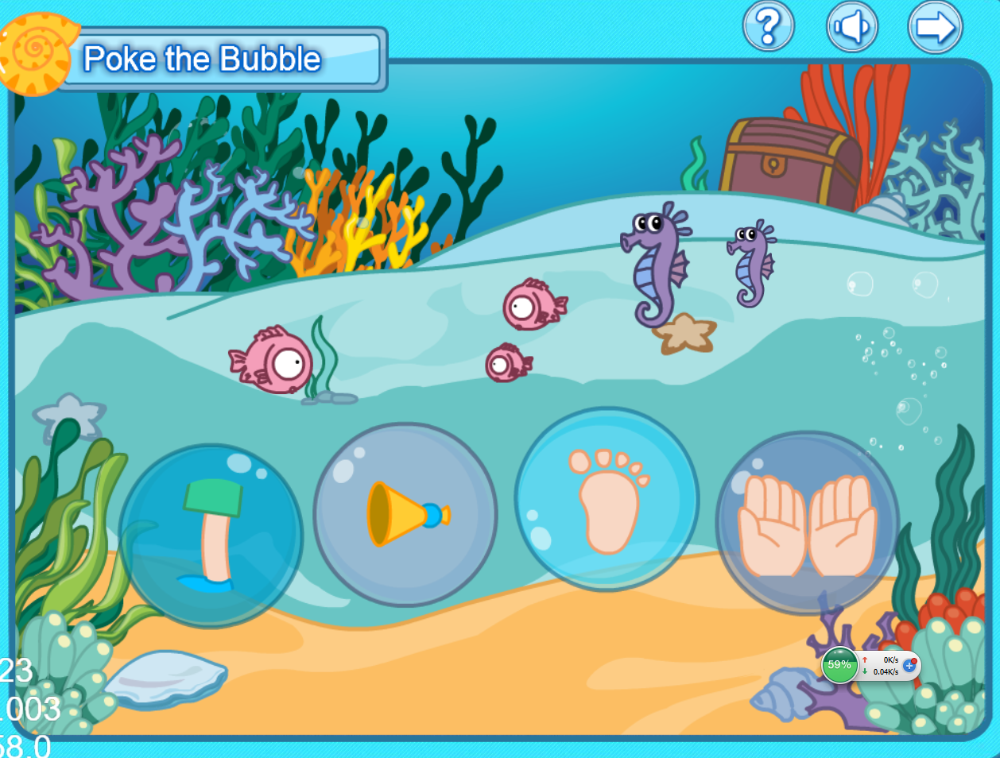

The game is made with cocos2d-js(html5) in this time last year . And at that time I has just learn cocos for one or two weeks, the code looks pretty :)

## First, let's go and see

[Listen and choose](/listennchoose/index.html)

## A kick start of cocos-js
 
A Project json like this  

    {
      "project_type": "javascript",
      "debugMode": 0,
      "showFPS": true,
      "frameRate": 60,
      "id": "gameCanvas",
      "renderMode": 0,
      "modules": [
        "cocos2d",
        "extensions",
        "external"
      ],
      "jsList": [
        "src/GameScene.js",
        "src/app.js",
        "src/resource.js"
      ]
    }
 
and a html which include cocos2d-js-v.js  and div for drawing canvas 

At last prepare your Scene and resources. 

