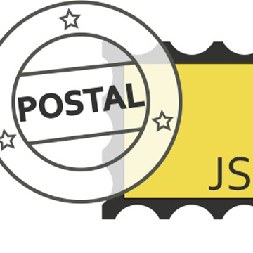

Postaljs是一款js pub/sub 库，相当于为页面应用提供了一个新的事件/消息系统。 作为原始JS开发，貌似对这种事件系统需求不大，然而要使用组件化开发，无论是reactjs还是angular，这种事件系统都会起到很大的作用。   

 

## Why PostalJS

其实，我开发js这么多年，一直也没有感觉有一个事件系统或者消息系统的需要。 主要原因还是在整个DOM页面中，要调用谁或者发送消息，直接 $ 一下就好了，当然也和应用性质相关。 
 
 
最近使用Reactjs开发， 页面组件化倒是实现了，但有个关键问题就是组件间通讯。

我们知道reactjs组件是以一个树状形式组织的，作为UI组件化，相信这样的结构是有道理的，我们的DOM本身也是一个树状结构。 然而组件之间的调用只能有2个方式：

1. 父调用子，使用refs
2. 子调用父，使用props

很多时候，如果2个组件间不是这样的关系，就只能一个组件逐层往上调用，直到一个共同的祖先，在顺次调用下去。这样是非常不合理的，我想跨越层次结构调用的需求是必然存在的。

为此，一个解决方法是将所有组件扁平化，虽然解决了逐层调用的尴尬问题，但也造成组件和ui原始特性的不匹配，有可能造成更大的不合理。 

在react官方，也给出的解决方案就是建议使用一个消息系统。 [PostalJS](https://github.com/postaljs/postal.js) 就是一个很好的选择。

Postal是一个典型的事件订阅框架。 这也是我们学计算机一个经典模型，它在DOM模型中事件的逐层传递特性之外，将消息发到通道(channel)中。

可以定义多个通道，每个通道可能有多个生产者/消费者。 生产者就对应调用方，消费者对应被调用方。

当然作为消息系统本身， 还能实现更多的功能。在react中，我们还是用来解决跨层组件调用问题。

## 安装

### 普通安装

引入 postal.lodash.min.js 即可 

### npm安装 
    
> npm install postal --save-dev

在js中

   var postal = require("postal");
   
然后就可以正常 订阅/发布 消息了
   
#### 发布消息 
   
      postal.publish({
          channel: "orders",
          topic: "item.add",
          data: {
              sku: "AZDTF4346",
              qty: 21
          }
      });

#### 订阅消息 

    var subscription = postal.subscribe({
           channel: "orders",
           topic: "item.add",
           callback: function(data, envelope) {
               // `data` is the data published by the publisher.
               // `envelope` is a wrapper around the data & contains
               // metadata about the message like the channel, topic,
               // timestamp and any other data which might have been
               // added by the sender.
           }
    });
    

    